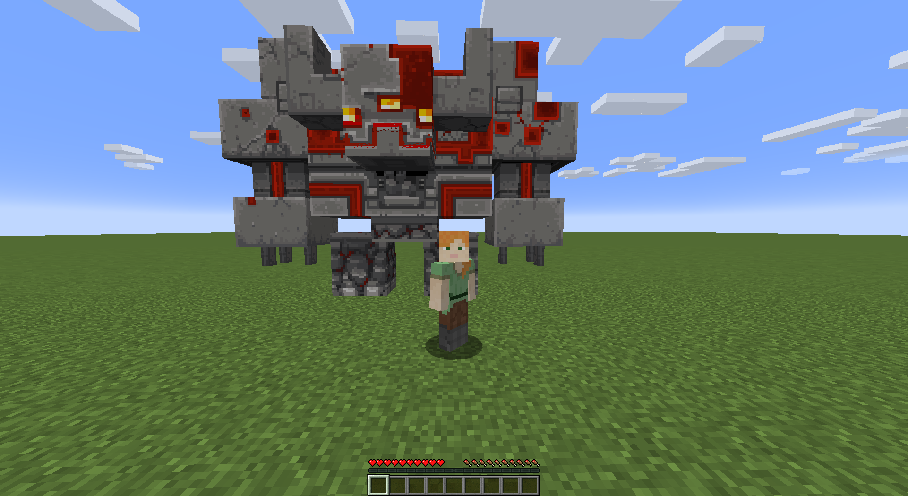

## Getting Started

Welcome to the `hephaestus-engine` documentation.

Hephaestus-engine is a custom model creation, animation and interaction library
for Minecraft: Java Edition, you can use it in multiple platforms like Spigot,
[Paper](https://papermc.io/) and [Minestom](https://minestom.net/)

*Note that hephaestus-engine is a work in progress, we are looking for
contributors.*

### Features

- Automatic and extensible resource-pack generation using [creative](https://github.com/unnamed/creative)
- Flexible model animation support, lets you handle how to animate the models:
asynchronously in a single thread, asynchronously in multiple threads, etc
- [Blockbench](https://blockbench.net/) model loading (loads the model itself,
its textures and animations)

Yes, this is vanilla Minecraft